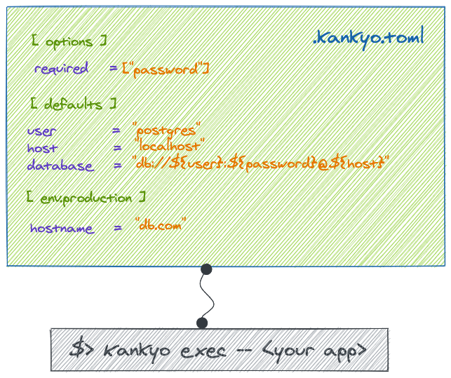

# Kankyō

環境, かんきょう

An configurable and environment aware .env alternative.

[](https://forthebadge.com)
[](https://forthebadge.com)



<!-- START doctoc generated TOC please keep comment here to allow auto update -->
<!-- DON'T EDIT THIS SECTION, INSTEAD RE-RUN doctoc TO UPDATE -->

- [Getting started](#getting-started)
    - [Adding to your project](#adding-to-your-project)
    - [Installed globally](#installed-globally)
    - [With npx](#with-npx)
- [Usage](#usage)
  - [From the command line](#from-the-command-line)
  - [Programatically](#programatically)
  - [Fron NPM scripts](#fron-npm-scripts)
- [Environment file](#environment-file)
- [Generating the file](#generating-the-file)
  - [Default Variables](#default-variables)
  - [Configurable Environments](#configurable-environments)
  - [Options](#options)
    - [Required fields](#required-fields)
      - [CI/CD](#cicd)
- [String interpolation](#string-interpolation)
- [Full file example](#full-file-example)
- [Cross-platform](#cross-platform)
- [License](#license)

<!-- END doctoc generated TOC please keep comment here to allow auto update -->

## Getting started

#### Adding to your project

`npm install --save kankyo`

#### Installed globally

`npm install -g kankyo`

#### With npx

`npx kankyo exec -- node app.js`

## Usage

### From the command line

```bash
$> npx kankyo --help

Usage: cli [options] [command]

Options:
  -q --quiet        Quiet mode
  -e, --env <env>   Specify the environment manually
  -f --file <file>  Specify the environment file
  -V, --version     output the version number
  -h, --help        display help for command

Commands:
  init
  exec
  help [command]    display help for command
```

By using the cli's `exec` command, followed by your own shell command, Kankyō will load the environment and run the specified command with it.

e.g

`npx kankyo exec -- command arg1 arg2 arg3`

### Programatically

At the earliest stage possible, you can require Kankyō and call its `inject` method to load up the environment file into the current environment. As you would traditional `.env` files

e.g

```javascript
require('kankyo').inject();

console.log(process.env);
```

### Fron NPM scripts

Configure your scripts to run anything with Kankyo

```javascript
{
  // ...
  "scripts": {
    "start": "kankyo exec -- node app.js"
  }
}
```

## Environment file

Kankyo is configured using a custom [TOML](https://toml.io) file

The default file name is `.kankyo.toml`

However it also supports the following names as alternatives:

- `.kankyo.toml`
- `.environment.toml`
- `.env.toml`
- `kankyo.toml`
- `environment.toml`
- `env.toml`

## Generating the file

A file can be generated inside your project using the following command:

`npx kankyo init`

### Default Variables

Start by setting the default variables of your environment

```toml
[defaults]

hostname      = "hello"
database_name = "my_db"
```

### Configurable Environments

You can set any number of custom environments, here's an example of us setting a `staging` environment

```toml
[defaults]

# ...

[env.staging]

database_name = "my_staging_db"
```

When run in staging mode, the default `database_name` will be overridden by the value set under the staging block

### Options

* `env_var` - Set the variable name that defines which environment is used. Defaults to `NODE_ENV`
* `uppercase` - If set, will uppercase all environment variable names. Defaults to `true`
* `required` - An array of variable names which must be provided

#### Required fields

Under the `[options]` block, you can add a list of required variables

e.g

```toml
[options]

required = ["API_KEY]
```

An exception will be raised if that variable is missing during runtime

```bash
> kankyo exec -- <your app>

  kankyo:info Kankyo environment file detected: .kankyo.toml +0ms
  kankyo:info Loading environment +1ms
  kankyo:error Missing environment variables: API_KEY +0ms
```

This forces users to either :

- Add the value to the file (either in defaults or in the environment)
- Add it to the shell environment

```bash
> API_KEY=123 kankyo exec -- <your app>

  hello world !
```

##### CI/CD

This feature is particularly useful when dealing with critical variables such as passwords, api keys.

Your CI/CD platform can fill in those keys during deployment, and the error message keeps developers aware when working locally.

## String interpolation

Variables defined in the Kankyō file support string interpolation using the `"${...}"` format.

Example:

```toml
[defaults]

word_a    = "foo"
word_b    = "bar"
sentence  = "${word_a} ${word_b}"
```
## Full file example

```toml
[options]

env_key     = "NODE_ENV"
uppercase   = true

[defaults]

word_a    = "foo"
word_b    = "bar"
sentence  = "${word_a} ${word_b}"

[env.production]

word_a = "hello"
word_b = "world"
```

## Cross-platform

Kankyō is not limited to nodejs projects. The `kankyo exec` command can run any type of project

Example with Ruby:

Set the `env_key` option to desired key

```toml
[options]

env_key     = "RUBY_ENV"

# ...
```

and run your ruby project

`RUBY_ENV=development kankyo exec -- ruby program.rb`

## License

MIT License

Copyright (c) 2021 Patrick R

Permission is hereby granted, free of charge, to any person obtaining a copy
of this software and associated documentation files (the "Software"), to deal
in the Software without restriction, including without limitation the rights
to use, copy, modify, merge, publish, distribute, sublicense, and/or sell
copies of the Software, and to permit persons to whom the Software is
furnished to do so, subject to the following conditions:

The above copyright notice and this permission notice shall be included in all
copies or substantial portions of the Software.

THE SOFTWARE IS PROVIDED "AS IS", WITHOUT WARRANTY OF ANY KIND, EXPRESS OR
IMPLIED, INCLUDING BUT NOT LIMITED TO THE WARRANTIES OF MERCHANTABILITY,
FITNESS FOR A PARTICULAR PURPOSE AND NONINFRINGEMENT. IN NO EVENT SHALL THE
AUTHORS OR COPYRIGHT HOLDERS BE LIABLE FOR ANY CLAIM, DAMAGES OR OTHER
LIABILITY, WHETHER IN AN ACTION OF CONTRACT, TORT OR OTHERWISE, ARISING FROM,
OUT OF OR IN CONNECTION WITH THE SOFTWARE OR THE USE OR OTHER DEALINGS IN THE
SOFTWARE.
